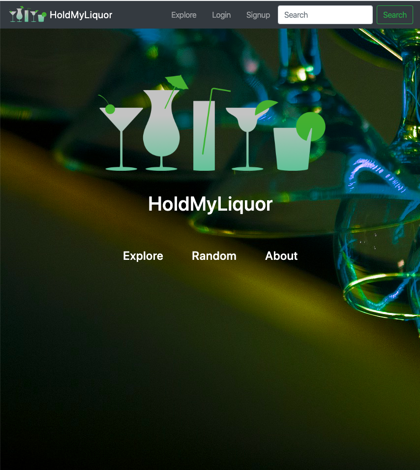
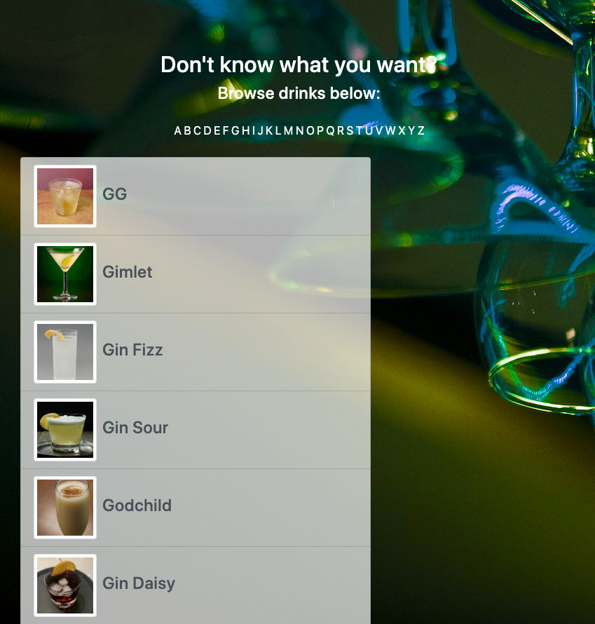
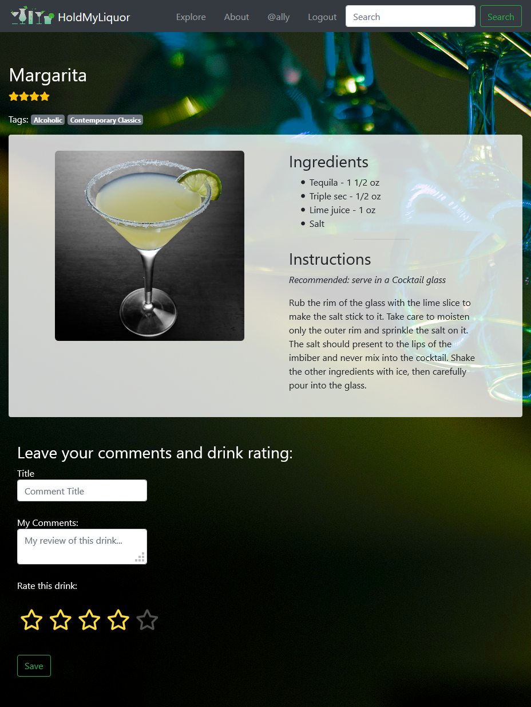

# HoldMyLiquor

If you have ever wanted to know the recipe for making a great drink (alcoholic or non-alcoholic), this is your site! You can easily search for a drink by name and also new and exciting beverages by search. For example, searching ‘Margarita’ will pull up ‘Margarita’, ‘Blue Margarita, ‘Tommy’s Margarita’, and more.

## Description

This site is built using an API from Cocktail DB API. We used the drink recipe info to create a site that is built for searching, exploring, and rating beverages. As an unregistered user, you can still peruse the drinks using the Explore (search for a drink by alphabetical letter) and the Random (randomly generates a new drink with recipe) links. When the user registers and logs in, they are able to rate a beverage. They can leave specific comments allowing other users to see their comments and ratings. As a user, you can login and also see your Favorite Drinks and Reviews.

## Tools used:

- Bootstrap
- Cocktail DB API
- Font Awesome

## Screenshots





## Features

This project incorporates both backend and frontend. We were able to use a reliable API to create a useful site for finding cocktails based on searching and exploring. We made a mobile-first designed site with Bootstrap, Express, es6Renderer and PostgreSQL. This site is functional because there are so many options for beverages both alcoholic and non, and the user can load their information and store it in the database.

## Installation

### Clone

- Clone this repo to your local machine

### Setup

install npm packages

```
$ npm i
```

- Create postgreSQL database based on schema ("SQLSchema.sql")
- Connect database info accordingly via .env file

_Sample/template .env below:_

```
DB_HOST=YOUR DB_HOST_HERE
DB_NAME=YOUR_DB_NAME_HERE
DB_USER=YOUR_DB_USERNAME_HERE
DB_PW=YOUR_DB_PASSWORD_HERE
PORT=3000
```

- run program

```
$ npm run dev
```

## Image sources:

- [Site logo](https://pixabay.com/vectors/glass-silhouette-drink-alcohol-35622/)
- [Background](https://pixabay.com/photos/party-wine-glasses-bar-bartender-2250007/)
- [Drink Lineup](https://pixabay.com/vectors/cocktails-summer-beverages-1419481/)

## Authors:

- Ally Brannon - [GitHub](https://github.com/allybrannon)
- Victor Gamble - [GitHub](https://github.com/VictorGamble)
- Karley Petracca - [GitHub](https://github.com/karleypetracca)
